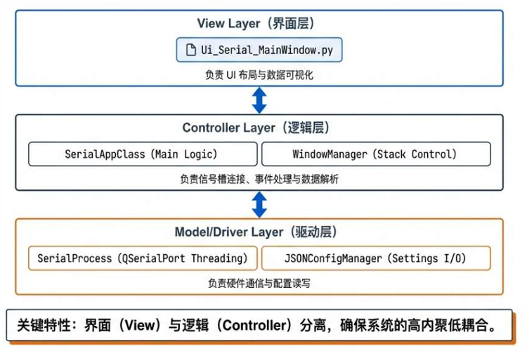
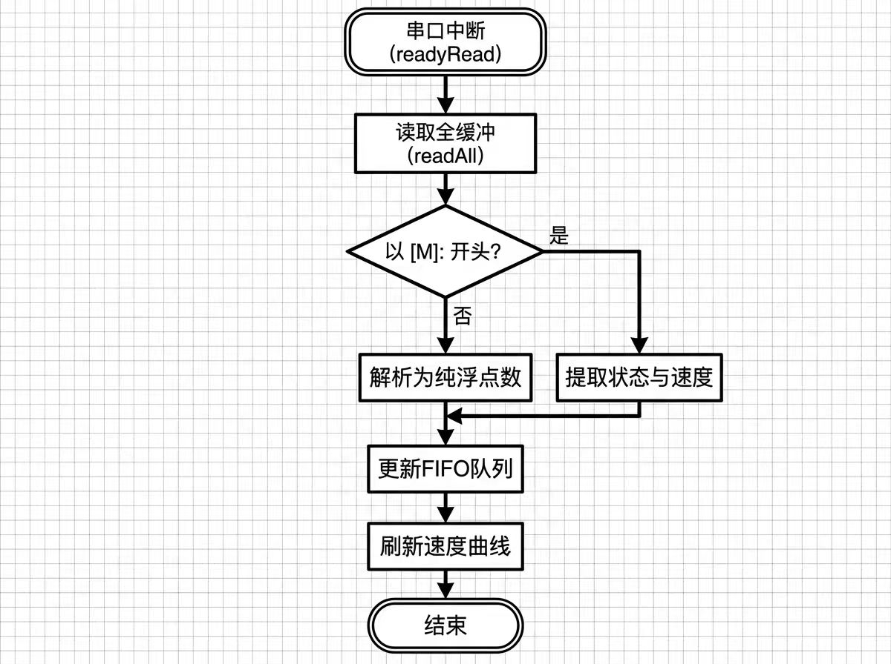
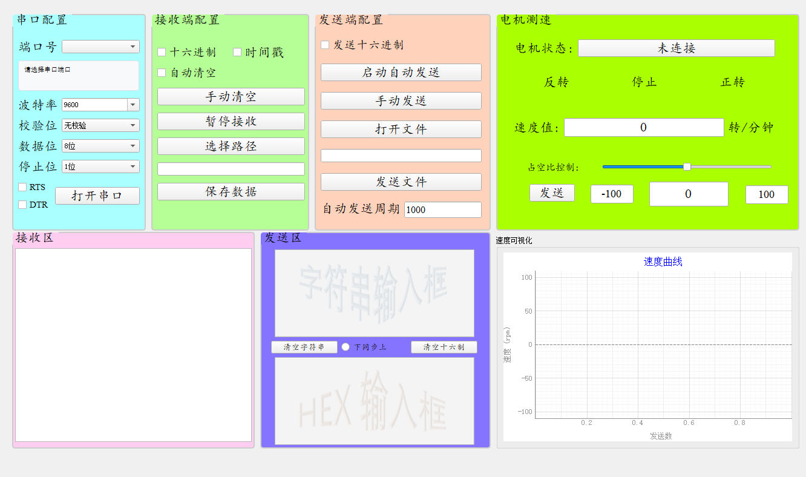

# 第6章 上位机软件设计与实现

本系统的上位机软件主要负责与下位机（STC89C51）进行数据交互、解析速度信号、实时显示波形曲线以及管理系统配置。软件基于 Python 语言开发，采用 PyQt5 图形界面框架，遵循模块化的 MVC 设计模式，以确保系统的稳定性与可扩展性。

## 6.1 开发环境与总体结构

### 6.1.1 开发环境
- **编程语言**: Python 3.8+
- **GUI 框架**: PyQt5 (v5.15)
- **绘图库**: PyQtGraph (用于高速实时波形绘制)
- **串口通信库**: PyQt5.QtSerialPort (基于 Qt C++ 引擎的异步串口库，优于传统的 PySerial)
- **IDE**: Visual Studio Code

### 6.1.2 目录与文件结构
项目采用功能分包的结构，核心代码集中在 `Serial_Port` 目录下：

```text
PortMonitor/
├── WindowManager.py          # 顶层窗口管理器
├── Serial_Port/
│   ├── app_SerialProcess.py  # [Model] 串口通信底层逻辑封装
│   ├── app_SerialWindows.py  # [Controller] 业务逻辑与界面交互控制
│   ├── Serial_MainWindow.py  # [View] 由 UI 文件生成的界面代码
│   ├── config_manager.py     # [Data] 配置持久化管理
│   └── config.json           # 配置文件
```

## 6.2 MVC 软件架构设计

为了降低界面逻辑与业务逻辑的耦合度，本软件严格遵循 MVC (Model-View-Controller) 设计架构。

- **Model (模型层)**: 由 `app_SerialProcess.py` 中的 `SerialProcess` 类和 `config_manager.py` 组成。`SerialProcess` 负责底层的串口打开、关闭、读写操作，该类继承自 `QObject`，不包含任何 UI 元素，仅通过 `pyqtSignal` 信号向外传递数据。
- **View (视图层)**: 由 Qt Designer 设计生成的 `Serial_MainWindow.py` 构成，主要负责界面布局与控件初始化，不可以直接包含业务逻辑。
- **Controller (控制器层)**: `app_SerialWindows.py` 中的 `SerialAppClass` 是系统的控制中枢。该类负责初始化 View 和 Model，将 Model 发出的 `data_received` 信号连接至 View 的显示槽函数，从而实现数据流的自动化流转。



## 6.3 异步通信与数据解析机制

### 6.3.1 异步接收机制
鉴于串口数据到达的不确定性，软件采用 Qt 的事件驱动机制替代传统的轮询方式。当底层驱动检测到 RX 缓冲区存在数据时，触发 `readyRead` 信号，调用 `read_data()` 函数并使用 `readAll()` 接口一次性取出缓冲区所有字节，有效避免了高波特率下的数据堆积问题。

### 6.3.2 帧解析与协议拆解
接收到的原始字节流可能包含不完整的帧或粘包数据。系统在 `on_data_received` 方法中实现了应用层协议解析，支持两种通讯模式：
1. **简单模式**: 仅包含浮点数值（如 `123.45\n`），适用于纯测速场景。
2. **状态模式**: 遵循 `[M]:状态码,速度值` 格式（如 `[M]:1,1500\n`）。

具体解析流程如下：
1. **解码**: 将 `QByteArray` 解码为 `UTF-8` 字符串，设置忽略非法字节策略。
2. **清洗**: 去除字符串首尾的空白符。
3. **识别**: 判断数据帧头是否为 `[M]:`。若匹配，则按分隔符提取状态码和速度值；若不匹配，尝试直接转换为浮点数。
4. **容错**: 捕获转换过程中的异常，防止畸形数据导致程序崩溃。



## 6.4 通信流程与配置持久化

### 6.4.1 参数配置与持久化
为了确保配置的一致性，软件实现了基于文件的配置持久化机制。通过 `JSONConfigManager` 类，系统将用户的关键操作（如修改波特率、切换Hex发送模式）实时写入 `config.json` 文件。

程序启动时，`load_last_settings()` 方法会自动读取配置文件，恢复主窗口几何位置、流控设置及通信参数，从而还原上次关闭前的工作环境。

### 6.4.2 自动发送逻辑
在电机稳定性测试中，系统需支持周期性指令发送。该功能通过 `QTimer` 定时器实现。当设定好发送间隔（如 1000ms）后，控制器启动定时器，定期调用 `send_data()` 接口将缓冲区数据写入串口硬件发送缓冲区。

**表 6-4 串口通信参数配置表**

| 参数名称 | 可选范围 / 格式 | 默认值 | 说明 |
| :--- | :--- | :--- | :--- |
| **波特率 (BaudRate)** | 9600, ..., 115200 | 9600 | 决定通信速率，需与下位机匹配 |
| **数据位 (DataBits)** | 5, 6, 7, 8 | 8 | 标准 UART 通信配置 |
| **校验位 (Parity)** | None, Odd, Even | None | 错误校验机制 |
| **停止位 (StopBits)** | 1, 1.5, 2 | 1 | 帧结束标志 |
| **流控制 (FlowControl)** | RTS/CTS, DTR, None | None | 硬件握手控制 |

## 6.5 可视化界面实现

上位机界面基于 `QMainWindow` 构建，布局分为左侧配置控制区与右侧数据可视区。

- **实时测速曲线**: 采用 `PyQtGraph` 库的 `PlotWidget` 控件实现。数据容器使用 `collections.deque` 固定长度队列（maxlen=200），新数据入队时自动移除旧数据，以保证内存占用的稳定性。绘图刷新率满足 60FPS 标准，能够平滑展示电机启动、加速及稳态过程中的速度变化。
- **状态监控**: 界面底部状态栏实时显示串口接收与发送的字节数统计，用于通信故障排查。
- **交互控制**: 支持十六进制 (Hex) 与 ASCII 字符串的切换显示与发送，满足多样化的调试需求。


